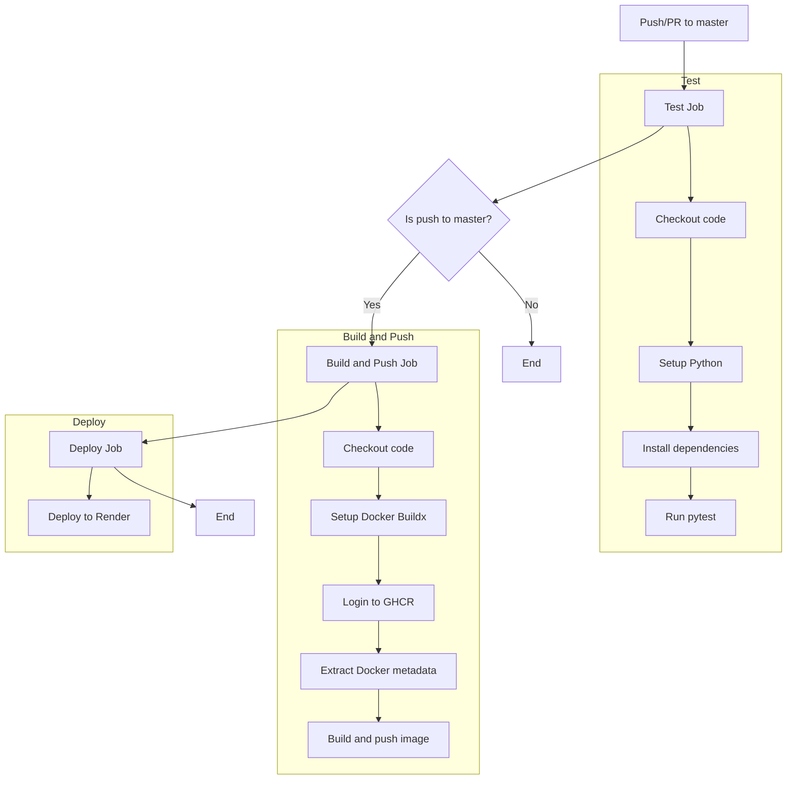
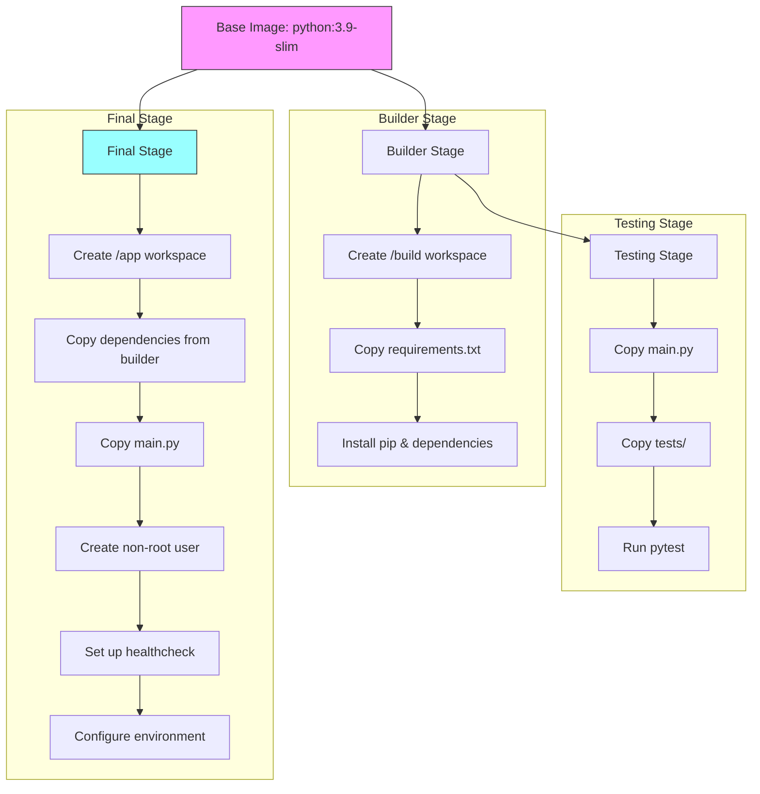

# 🕸️ netics-assignment-1

This repository contains my submission for the first assignment in NETICS Open Recruitment.

> p.s. gonna write this in EN, mostly bcs I write faster in EN, but also that I cba writing in ID lol.

| Key              | Val                                                                                                                        |
| ---------------- | -------------------------------------------------------------------------------------------------------------------------- |
| Name             | Faiz Muhammad Kautsar                                                                                                      |
| Student ID (NRP) | 5054231013                                                                                                                 |
| Deployment URL   | [https://netics-assignment-1.spuun.art/health](https://netics-assignment-1.spuun.art/health)                               |
| Status Page URL  | [https://hetrixtools.com/r/adbdb5c508a2763f1244b328bff6a0ce/](https://hetrixtools.com/r/adbdb5c508a2763f1244b328bff6a0ce/) |

# 📝 preface

For this assignment, we were tasked with the deployment (as in, CI/CD) of a basic RESTful API with a `/health` route on `GET`. The example response provided within the spec goes as follows:

```json
{
  "nama": "Tunas Bimatara Chrisnanta Budiman",
  "nrp": "5025231999",
  "status": "UP",
  "timestamp": time,	// Current time
  "uptime": time		// Server uptime
}
```

Seems simple enough, not much was provided with respect to the constraints regarding implementation details, so it was really left up to the participants to implement it however they'd like.

Deployment-wise, the doc expected some "best practices", though stayed somewhat "vague" with the specifics as well, so I assumed that this depends on the implementation details as well.

# 👩‍💻 implementation

To start things off, implementing the API, I implemented a basic `FastAPI` api,

```python
app = FastAPI()
START_TIME = time.time()


@app.get("/health")
async def health_check():
    uptime_seconds = int(time.time() - START_TIME)
    uptime_formatted = humanize.precisedelta(
        timedelta(seconds=uptime_seconds), format="%d"
    )

    return {
        "nama": "Faiz Muhammad Kautsar",
        "nrp": "5054231013",
        "status": "UP",
        "timestamp": datetime.now().isoformat(),
        "uptime": uptime_formatted,
    }
```

then shoved that into `uvicorn` as its ASGI server.

# ⚙️ integration & deployment

To deploy the service, since I didn't have a VPS on hand to use for this ~~and I didn't want to use NPC's VPS lmoa~~, I used [Render](https://render.com).

The CI/CD pipeline goes roughly as follows:



You can see this implemented over at [./.github/workflows/deploy.yml](./.github/workflows/deploy.yml), used GH Actions to get this to run.

The reason why I'd used this multi-stage thing was to implement that CI/CD workflow of unit testing, then building, then pushing. By isolating the testing stage off the build-and-push stage, this pipeline keeps the prod secure (as anything that fails won't proceed over to the push and deployment stage).

This "isolation" principle is kept in both the deployment and building stage. Case in point, to ensure that thorough testing is done on the entire workflow, I added another testing stage within the building stage in the [Dockerfile](./Dockerfile) (admittedly this _is_, in retrospect, a bit redundant lol, yes. However I'm still of the opinion that this thoroughness, given the tiny scope of the app, is all-in-all fine, though I would've removed it off the Dockerfile and have it in the workflow instead, otherwise they're about equivalent in utility though, since the workflow depends on the build working out anyway).

The building stage, in the [Dockerfile](./Dockerfile), goes roughly as follows:



The way I set it up somewhat didn't assume the fact that I'd be deploying to [Render](https://render.com) tbh (hence that HEALTHCHECK), but it's really for the most part deployment env-agnostic, I'll try breaking it down. To build, it:

1. sets up a builder image from `python:3.9-slim`,
2. creates a `/build` directory,
3. copies the requirements file,
4. installs the deps.

Then, it moves over to the testing stage, with the same image:

1. copies the main.py,
2. copies the tests,
3. runs the tests via pytest.

Finally, it sets up the deployment image:

1. gets a new `python:3.9-slim` image,
2. copies the deps folder(s) from the builder image,
3. copies the `main.py` script,
4. creates a non-root user,
5. puts it on,
6. sets up a healthcheck,
7. sets up the `CMD` which acts as the entrypoint.

When it comes to the deployment stage in the workflow, it's structured in this way such that, again, there's that separation of concerns with respect to each stage in the integration process. Say the build worked out, but [Render](https://render.com)'s environment went all broke on it, we can revert to the previous build by keeping the built image artifacts already on the GCHR repo.

Deploying over to [Render](https://render.com) works out like this:

1. image is built,
2. push to GCHR,
3. access Render's API to trigger a redeployment with a `latest` image.

Since Render's free thing has a sleeping thing like other hosting providers (e.g. Vercel or Netlify or Glitch or Replit or smth), I had to set up a pinger service to ensure that it doesn't sleep. The first thing that came to mind was [Uptimerobot](https://uptimerobot.com/) since I'd used it for a previous project before, but either I forgot or haven't heard about this, but they now only support `HEAD` requests to check for uptime, which, well, I _can_ technically just, make the app respond to `HEAD`s probably, but I cba, so instead we look for another.

In the end, I used [HetrixTools](https://hetrixtools.com/) to get it going. As far as I can tell, it's been running pretty solid, _and_ as a bonus, I got a [status page](https://hetrixtools.com/r/adbdb5c508a2763f1244b328bff6a0ce/) to go along with it :)) Albeit not a really nice looking one, but it's p good for literally free, so.

# 🗿 "best practices"

With implementation and deployment of the API out of the way, let's get to the "best practices" I implemented.

### 1. "unit testing"

Tbf, this isn't exactly "unit" testing, since the code is really just, practically _just_ that route lol, however I did implement some testing via `pytest` [here](./tests).

```python
from main import app

client = TestClient(app)


def test_health_endpoint():
    response = client.get("/health")

    assert response.status_code == 200
    data = response.json()

    assert "nama" in data
    assert "nrp" in data
    assert "status" in data
    assert "timestamp" in data
    assert "uptime" in data

    assert data["nama"] == "Faiz Muhammad Kautsar"
    assert data["nrp"] == "5054231013"
    assert data["status"] == "UP"

    try:
        datetime.fromisoformat(data["timestamp"])
    except ValueError:
        pytest.fail("Timestamp is not in valid ISO format")

    print("All tests passed!")
```

### 2. "clear separation of concerns"

Okay, to be fair, this is smth I've already went over up there, but the idea with my submission is that we try to keep as much separation of concerns within the integration pipeline as possible.

Another example here is, let's look at that `Dockerfile` I implemented, when doing the build it runs it by two isolated environments.

```dockerfile
# "Building"
FROM python:3.9-slim AS builder

# ... snip ...

# Testing
FROM builder AS testing

# ... snip ...

# Deploy
FROM python:3.9-slim

# ... snip ...
```

This is to keep the "deployment" environment clean of the "building" environment, if something weird was modified during the building or testing process of the Dockerfile, the deployment image stays clean.

### 3. secure deployment

To ensure that the app's deployed "securely", I set up a low-privilege user, this is applying that [principle of least privilege](https://en.wikipedia.org/wiki/Principle_of_least_privilege) when it comes to deploying things securely. This is so that, for the most part, if the app was compromised (I'd be surprised if it did tbh aksndals), the access scope is relatively limited to that low-privilege user.

### 4. incident response

_Technically_, out of scope, but I was pretty happy with the bonus thing of deploying w/ Hetrix lol, so, um, well, the deployment now has pretty good incident response set up, the thing has alerts for when it goes down and has a status page.
